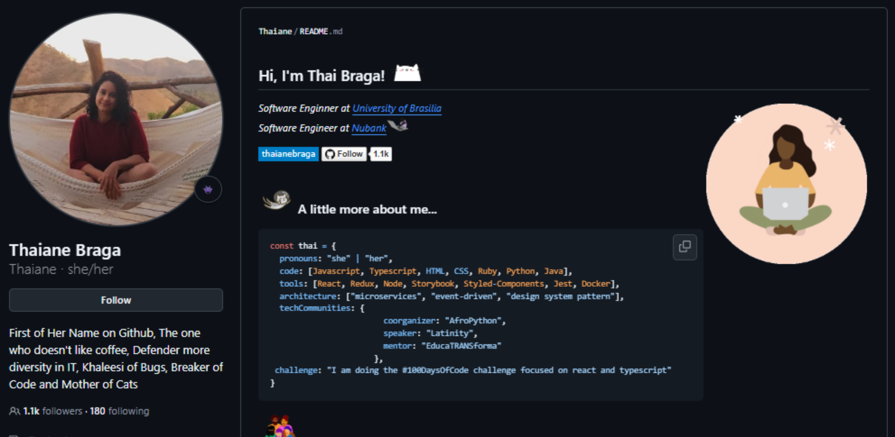
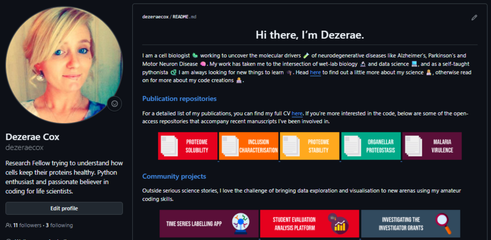

## Git vs GitHub

::: {.callout-note}
**Git** lives on your computer. **GitHub** is a website that talks to Git. They work together — but they are not the same thing.
:::

| Git | GitHub |
|---|---|
| Runs on your machine | A website (cloud hosting) |
| Tracks changes to files | Stores a copy of your repo online |
| Works entirely offline | Enables sharing, collaboration, and backup |
| The version control *engine* | The version control *destination* |

::: {.callout-important}
You can use Git without GitHub — but you can't use GitHub without Git.
:::

## Pushing to GitHub

### Bash workflow

```bash
# 1. Create a new empty repository on GitHub (no README, no .gitignore)

# 2. Connect your local repo and push for the first time
git remote add origin https://github.com/username/repo-name.git
git branch -M main
git push -u origin main

# 3. All future pushes
git push
```

::: {.callout-note}
You only run `git remote add` once. After that, `git push` and `git pull` know where to go.
:::

### GUI workflow

::: {.panel-tabset}

### Python (VSCode)

1. Open the **Source Control** tab (`Ctrl+Shift+G`)
2. Click **Publish Branch** (appears after your first commit)
3. Sign in to GitHub if prompted
4. Choose **Public** or **Private**
5. VSCode creates the repo on GitHub and pushes automatically
6. Future commits: click **Sync Changes** (↑↓) to push

### R (RStudio)

1. In the console, run `usethis::use_github()`
2. Choose **Public** or **Private** when prompted
3. RStudio creates the repo on GitHub and pushes automatically
4. Future commits: click the **Push** button (↑) in the Git tab

:::

## Cloning

**Cloning** is the opposite of publishing — you copy a repository from GitHub onto your local machine.

You might clone a repository to start from a template, get a copy of someone else's code, or work on a different machine.

```bash
git clone https://github.com/username/repo-name.git
cd repo-name
```

::: {.callout-note}
`git clone` downloads the files, the full commit history, and the Git setup needed to keep working locally.
:::

### GUI cloning

::: {.panel-tabset}

### Python (VSCode)

1. Open the Command Palette (`Ctrl+Shift+P`)
2. Run **Git: Clone**
3. Paste the repository URL
4. Choose where to save it locally
5. Click **Open** when prompted

### R (RStudio)

1. Go to **File → New Project → Version Control → Git**
2. Paste the repository URL
3. Choose where to save it locally
4. Click **Create Project**

### From GitHub

1. Open the repository on GitHub
2. Click the green **Code** button
3. Click **Open with GitHub Desktop**
4. Choose a local save location and click **Clone**

:::

## In practice

::: {.callout-caution}
### Exercises

2.5 Publish your local `spacewalk_analysis` repository to GitHub

2.6 Explore the repository on GitHub — commit history, README, and file structure

2.7 Update a file locally, then push the change to GitHub
:::

## Your GitHub homepage

A repository named **exactly the same as your username** becomes your public profile page. Here are some examples for inspiration:

{fig-align="center"}

{fig-align="center"}

{fig-align="center"}

{fig-align="center"}

A low-effort way to introduce yourself, showcase projects, and link to publications or your lab website. Don't worry about complexity — start with a few lines and links!

::: {.callout-caution}
### Exercises

2.8 Browse [awesome-readme](https://github.com/matiassingers/awesome-readme) for inspiration

2.9 Create a new repository on GitHub named `your-username`

2.10 Clone it to your computer and open in your preferred IDE

2.11 Write your `README.md` — commit along the way!

2.12 Push your changes back to GitHub
:::

## Quick reference

| Action | Command |
|---|---|
| Connect to GitHub | `git remote add origin <url>` |
| Push to GitHub | `git push` |
| Pull from GitHub | `git pull` |
| Clone a repo | `git clone <url>` |
