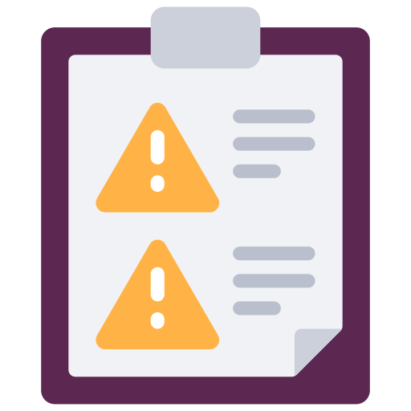
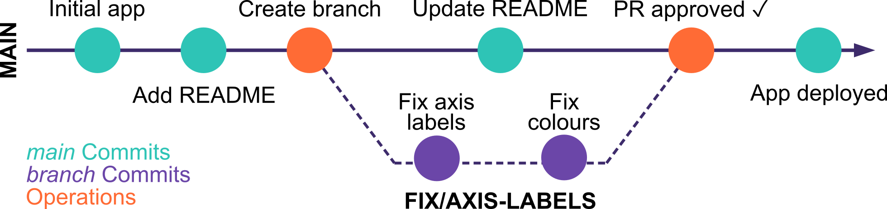

# Collaborative workflow

## Git(Hub)'s Guts

To clean code smells collaboratively, GitHub provides three extra functions: `issues`, `branches`, and `pull requests`.

:::: {.columns}
::: {.column width="30%" .fragment fragment-index=1}
{fig-align="center" height="200"}

::: {style="text-align:center"}
<h5 align="center">
Issue
</h5>

:::

A tracked record of something that needs attention — a bug, an improvement, or a question

:::
::: {.column width="3%" .fragment fragment-index=1}
:::

::: {.column width="30%" .fragment fragment-index=2}
{fig-align="center" height="200"}

::: {style="text-align:center"}
<h5 align="center">
Branch
</h5>

:::

A safe copy of the code where changes can be made without touching the in-use version

:::
::: {.column width="3%" .fragment fragment-index=1}
:::

::: {.column width="30%" .fragment fragment-index=3}
{fig-align="center" height="200"}

::: {style="text-align:center"}
<h5 align="center">
Pull Request
</h5>

:::

A request to merge your changes into the in-use version — with a built-in review step

:::
::::

## Issues: Tools to track what needs fixing

`Issues` are GitHub's built-in way to track bugs, tasks, and improvements.

Every issue has:

- A **title** — short and specific
- A **description** — what is wrong, where, and what the expected behaviour is
- An (optional) **label** — e.g. `bug`, `enhancement`, `good first issue`
- An (optional) **assignee** — who is responsible for fixing it

::: {.callout-tip}
### Remember: you are reviewing the *code*, not the *person* (even when that person is past you!). Be specific and constructive.
:::

## In Practice

::: {.callout-caution}

### Exercises

A senior team member has reviewed the repository and flagged some issues.

3.4 Using the provided `ISSUES.md`, create **at least one** GitHub issue in the manuscript repository — include a label, title and description

3.5 Review the repository yourself — can you spot anything else?

3.6 Record one additional code smell as a new issue

:::

## Branches: `main` and many more

::: {.callout-note}
### A `branch` is a copy of the codebase where you can make changes without affecting the in-use version.
:::

So far, everyone has been working directly on the `main` branch — the default live version of the code.

With collaborators, unprotected `main` means:

❌ Two people editing the same file at the same time creates conflicts

❌ Half-finished changes breaking things for everyone

❌ No way to review work before it goes live

{fig-align="center" height="140"}

## Branches: The workflow

::: {.panel-tabset}

### Python (VSCode)

1. Open the **Source Control** tab (`Ctrl+Shift+G`)
2. Click the branch name in the bottom-left status bar
3. Select **Create new branch** — name it `fix/issue-number-short-description`
4. Make your changes and commit as normal
5. Click **Publish Branch** in the Source Control tab

### R (RStudio)

1. In the **Git tab** (top-right), click the branch icon 🔀
2. Click **New Branch** — name it `fix/issue-number-short-description`
3. Make your changes and commit as normal (stage → message → Commit)
4. Click **Push** (↑) to push your branch to GitHub

:::

::: {.callout-tip}
### Branch names should be short and descriptive: `fix/3-axis-labels` or `fix/5-hardcoded-path`. The issue number makes it easy to trace back.
:::

## In Practice

::: {.callout-caution}

### Exercises

3.7 On GitHub, assign yourself to one of the open issues

3.8 In your IDE, create a new branch for your fix — name it `fix/<issue-number>-short-description`

3.9 Make your changes, commit with a clear message, and push the branch to GitHub

:::

## Pull Requests: The review loop

When your branch is ready, you open a `pull request` (PR) — a request to merge your changes into `main`. A PR lets your teammates:

- See exactly what changed, line by line
- Leave comments on specific lines
- Approve the changes — or ask for revisions
- Merge once everyone is happy

{fig-align="center" height="140"}

## Pull Requests: Workflow

::: {.panel-tabset}

### Opening a PR

1. After pushing your branch, go to the repository on GitHub
2. GitHub will show a banner: `Compare & pull request` — click it
3. Add a descriptive title
4. In the description, link to the issue by typing `#` followed by the issue number
5. Assign a teammate as reviewer
6. Click `Create pull request`

### Assigning a reviewer

1. Go to the `Pull requests` tab
2. Click the PR you want to be reviewed
3. On the right sidebar, click `Reviewers` → select a teammate (or yourself)

### Reviewing a PR

1. Open the repository on GitHub to the `Pull requests` tab
2. Open the PR you have been assigned to review
3. Click `Files changed` to see the diff — green lines are additions, red are deletions
4. Click the `+` next to any line to leave an inline comment
5. When done, click `Review changes` → choose:
   - ✅ `Approve` — looks good, ready to merge
   - 💬 `Comment` — feedback, but no verdict yet
   - ❌ `Request changes` — needs fixes before merging
6. Once ready → click `Merge pull request`

### Managing conflicts

1. If there are merge conflicts, GitHub will prevent merging and show which files are affected
2. The author of the PR (or anyone with write access) can resolve conflicts by:
   - Clicking `Resolve conflicts` on GitHub and editing the file in the browser,

   OR

   - Pulling the branch locally, fixing the conflicts in an IDE, committing, and pushing the resolved version back to GitHub
3. Once conflicts are resolved, the PR can be merged as normal

:::

## In Practice

::: {.callout-caution}

### Exercises

3.10 Via GitHub, open a pull request for your branch — link it to the issue and assign a teammate as reviewer

3.11 Review a teammate's PR — read the diff carefully, leave at least one comment, then approve

3.12 Once your own PR is approved, merge it — then watch the manuscript update live!

:::

## Quick reference

<table style="width:100%; font-size:0.85em; border-collapse:collapse; margin-top:0.5em">
  <tr>
    <td style="font-weight:bold; padding:0.4em 0.8em; width:45%">Add a collaborator</td>
    <td style="padding:0.4em 0.8em">Settings → Collaborators → Add people</td>
  </tr>
  <tr style="background:#f8f8f8">
    <td style="font-weight:bold; padding:0.4em 0.8em">Create an issue</td>
    <td style="padding:0.4em 0.8em">Issues tab → New issue → add label + assignee</td>
  </tr>
  <tr>
    <td style="font-weight:bold; padding:0.4em 0.8em">Create a branch (VSCode)</td>
    <td style="padding:0.4em 0.8em">Click branch name in status bar → New branch</td>
  </tr>
  <tr style="background:#f8f8f8">
    <td style="font-weight:bold; padding:0.4em 0.8em">Create a branch (RStudio)</td>
    <td style="padding:0.4em 0.8em">GitHub → Branches → New Branch</td>
  </tr>
  <tr>
    <td style="font-weight:bold; padding:0.4em 0.8em">Push a branch</td>
    <td style="padding:0.4em 0.8em">VSCode: Publish Branch &nbsp;|&nbsp; RStudio: Push (↑)</td>
  </tr>
  <tr style="background:#f8f8f8">
    <td style="font-weight:bold; padding:0.4em 0.8em">Open a pull request</td>
    <td style="padding:0.4em 0.8em">Push branch → GitHub banner → Compare & pull request</td>
  </tr>
  <tr>
    <td style="font-weight:bold; padding:0.4em 0.8em">Link PR to an issue</td>
    <td style="padding:0.4em 0.8em">Type <code>#issue-number</code> in the PR description</td>
  </tr>
  <tr style="background:#f8f8f8">
    <td style="font-weight:bold; padding:0.4em 0.8em">Review a PR</td>
    <td style="padding:0.4em 0.8em">Pull requests tab → Files changed → Review changes</td>
  </tr>
  <tr>
    <td style="font-weight:bold; padding:0.4em 0.8em">Merge a PR</td>
    <td style="padding:0.4em 0.8em">Approve → Merge pull request → Confirm</td>
  </tr>
</table>
