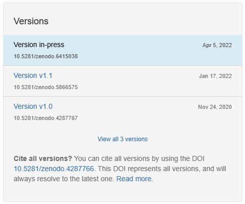
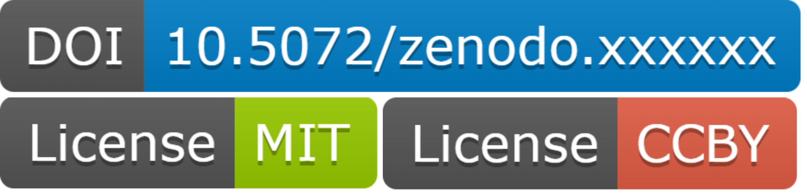

## Releases

Git has tracked every change you have made — but a paper needs to cite a **specific, stable version**.

A GitHub **release** is a named snapshot of your repository at a point in time, typically tied to a paper submission or publication.

Releases use **semantic versioning**: `vMAJOR.MINOR.PATCH`

- `v1.0.0` — first stable, publication-ready version
- `v1.1.0` — new features added after publication
- `v1.0.1` — bug fix, no new features

::: {.callout-tip}
For most research code, `v1.0.0` is the only release you will ever make — and that is completely fine.
:::

::: {.callout-important}
A GitHub release is a stable snapshot — but it is **not permanent**. It can be deleted or renamed, has no DOI, and cannot be cited in a paper on its own.
:::

## Zenodo

[**Zenodo**](https://zenodo.org) is an open research repository hosted by CERN. It will:

- Archive a **permanent** copy of your code
- Issue a **DOI** that can be cited in papers
- Index your work so others can find it

::: {.columns}
::: {.column width="55%"}
GitHub and Zenodo work together: when you create a release on GitHub, Zenodo automatically mints a DOI for that release, plus a persistent DOI for the entire repository — so you can cite a specific version, or cite the repository and it will always resolve to the latest release.
:::
::: {.column width="45%"}
{fig-align="center" height="300"}
:::
:::

## Workflow

::: {.callout-tip}
Today we will use [sandbox.zenodo.org](https://sandbox.zenodo.org) — a practice environment that issues test DOIs. It requires a separate account from zenodo.org, but the experience is identical.
:::

1. Go to [sandbox.zenodo.org](https://sandbox.zenodo.org) and sign in
2. Navigate to your account → **GitHub**
3. Find your repository in the list and **toggle it on**
4. Go to your repository on GitHub and create a new **Release** (tag: `v1.0.0`)
5. Return to Zenodo — your DOI will appear within a few minutes

## DOI badge & `CITATION.cff`

{fig-align="center" width="80%"}

Badges communicate key information at a glance. Zenodo provides a DOI badge for your release — copy the Markdown snippet and paste it into your `README.md`. Other badges (licence, latest release, build status) can be generated at [shields.io](https://shields.io).

```markdown
[](https://doi.org/10.5281/zenodo.xxxxxx)
```

A `CITATION.cff` file tells GitHub — and anyone who finds your repo — exactly how to cite your work. GitHub renders it as a **"Cite this repository"** button automatically.

```yaml
cff-version: 1.2.0
message: "If you use this software, please cite it as below."
authors:
  - family-names: Cox
    given-names: Dezerae
    orcid: https://orcid.org/0000-0000-0000-0000
title: "Spacewalk Analysis"
version: 1.0.0
doi: 10.5072/zenodo.xxxxxx
date-released: 2026-04-22
```

::: {.callout-tip}
[cffinit](https://citation-file-format.github.io/cff-initializer-javascript/) generates a valid `CITATION.cff` in your browser — no syntax knowledge needed.
:::

## In practice

::: {.callout-caution}
### Exercises

4.4 Make the repository public (`Settings → General → Change repository visibility`)

4.5 Link your GitHub account to [sandbox.zenodo.org](https://sandbox.zenodo.org) and enable tracking of your repository

4.6 Create a `v1.0.0` release — then watch Zenodo mint your DOI

4.7 Copy the DOI badge from your Zenodo record and add it to `README.md`

4.8 Use [cffinit](https://citation-file-format.github.io/cff-initializer-javascript/) to generate a `CITATION.cff`, add it to your repository, commit and push — check the **"Cite this repository"** button appears on GitHub
:::
