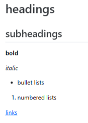

## The problem with "final"

{fig-align="center" height="350"}

We've all been there. Version control replaces this chaos with a systematic, reversible history of every change you make.

> *Version control is a systematic approach to record changes made in a file, or set of files, over time. This allows you and your collaborators to track the history, see what changed, and recall specific versions later when needed.*
>
> — The Turing Way

## What is Git?

{fig-align="center" height="150"}

**Git** is the industry-standard version control system — think of it like tracked changes in Word, but for your entire project, across almost every file type, with revision history, forever.

### Key concepts

::: {.columns}
::: {.column width="33%"}
{fig-align="center" height="200"}

**Repository** — a folder that Git watches, containing all the files to be tracked. It holds the full history of every change.
:::
::: {.column width="33%"}
{fig-align="center" height="200"}

**Commit** — a snapshot of your project at a point in time.
:::
::: {.column width="33%"}
{fig-align="center" height="200"}

**Staging** — the process of selecting which changes to include in the next snapshot.
:::
:::

## Repository structure

A repository (or *repo*) is just a normal folder with a hidden `.git` subfolder — that's where Git stores the full history. A typical research repo looks like:

```
my_project/
├── data/
│   ├── raw/          # original, untouched data — never modify!
│   └── processed/    # cleaned, transformed data
├── src/              # analysis scripts
│   ├── analysis.py
│   └── visualisation.py
├── notebooks/        # exploratory analyses
│   └── model_testing.ipynb
├── results/          # summaries and visualisations
│   └── report.csv
├── environment.yml   # or renv.lock
├── .gitignore
└── README.md
```

## README

Every repository should have a `README.md` — the quick-start guide for your project, written in Markdown.

::: {.columns}
::: {.column width="55%"}
Markdown adds formatting to plain text:

```markdown
# Heading
## Subheading

**bold** and *italic*

- bullet list
1. numbered list

[link text](https://site.com)
```
:::
::: {.column width="45%"}
{fig-align="center" height="250"}
:::
:::

A good README covers:

- **What** the code does
- What **dependencies** are required
- How to **install and run** it
- What the **inputs & outputs** are

{fig-align="center" height="350"}

::: {.callout-tip}
A comprehensive guide to Markdown syntax is available [here](https://docs.github.com/en/get-started/writing-on-github/getting-started-with-writing-and-formatting-on-github/basic-writing-and-formatting-syntax).
:::

## `.gitignore`

::: {.callout-important}
Not everything should be tracked by Git. A `.gitignore` file lists files and folders that Git will silently ignore.
:::

At minimum, **never** track:

- ❌ Raw data
- ❌ Results that can be regenerated from code
- ❌ Non-text files (e.g. `.Rhistory`, `.DS_Store`, Office files)
- ❌ Credentials and API keys

```bash
# Ignore all .csv files in the data directory
data/*.csv

# Ignore the entire results directory
results/*

# Ignore system files
.DS_Store
.Rhistory
credentials.txt
```

::: {.callout-tip}
[gitignore.io](https://www.gitignore.io) generates `.gitignore` templates for any language.
:::
