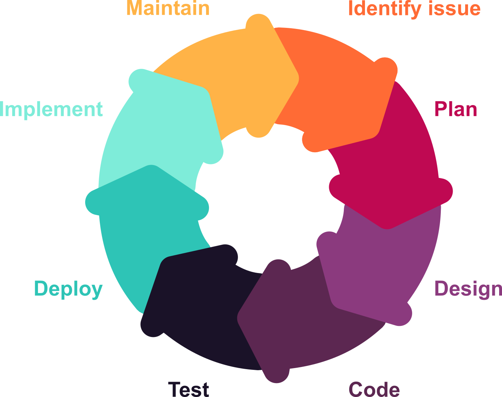
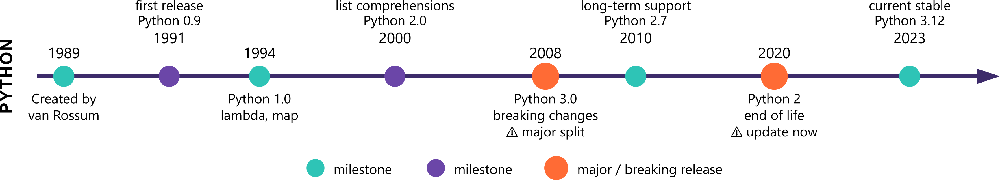
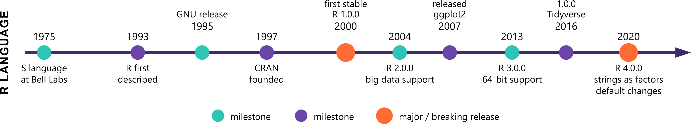

## Software is not static

{fig-align="center" height="300"}

Every piece of software you use is actively maintained. New features are added, bugs are fixed, and sometimes the way a function works *changes entirely*.

## Python example

{fig-align="center" height="150"}

```python
import random
population = {'A', 'B', 'C', 'D'}

# Python 3.10 and earlier — works fine
random.sample(population, 2)  # returns e.g. ['B', 'A']

# Python 3.11+ — raises a TypeError
# random.sample() no longer accepts sets
```

In Python 3.11, `random.sample()` stopped accepting sets to enforce deterministic results. The same code, different behaviour — because the language changed under it.

## R example

{fig-align="center" height="150"}

```r
df <- data.frame(group = c('A', 'A', 'B', 'B'), value = c(1, 2, 3, 4))

# R < 4.0
class(df$group)  # "factor"

# R 4.0+
class(df$group)  # "character"
```

In R 4.0, `stringsAsFactors` changed from `TRUE` to `FALSE` by default — silently breaking any code that assumed string columns were factors.

::: {.callout-important}
Code written in 2024 may not behave the same way in 2026. Two researchers running the "same" code on different installations may get different results.
:::
